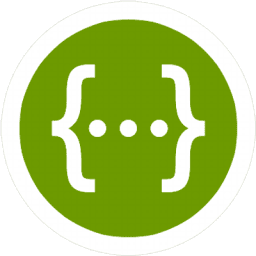
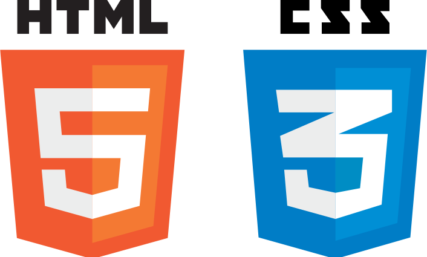
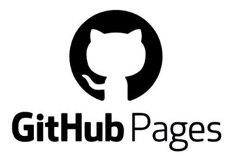

# Hi, I'm Rebecca. 👋

### I'm a mechanical engineer looking to break into the field of technical writing!

My goal is to learn new things and share with others through approachable and effective documentation.

I'm currently working on building my tech writing portfolio. If you need someone to write documentation for your project, contact me!

:mailbox_with_mail: Email: rem4@umbc.edu

### My focus areas include:

- API documentation
- Developer documentation
- Tutorials
- Getting Started guides
- Reference documentation

### Tools I'm familiar with:

    
    
    
    
    
    
    

Connect with me on [LinkedIn](https://www.linkedin.com/in/rebecca-mcclelland-598b36111).

