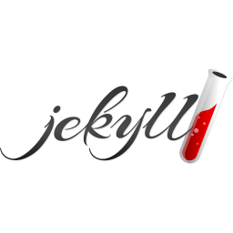

# Hi, I'm Rebecca. 👋

My goal is to learn new technologies and share with others through approachable and effective documentation.

✉️ rem4@umbc.edu

<!--
### My focus areas include:

- API documentation
- Developer documentation
- Tutorials
- Getting Started guides
- Reference documentation
-->

### Tools I'm familiar with:

    
    
    
    
    
    
    

Connect with me on [LinkedIn](https://www.linkedin.com/in/rebecca-mcclelland-598b36111).

